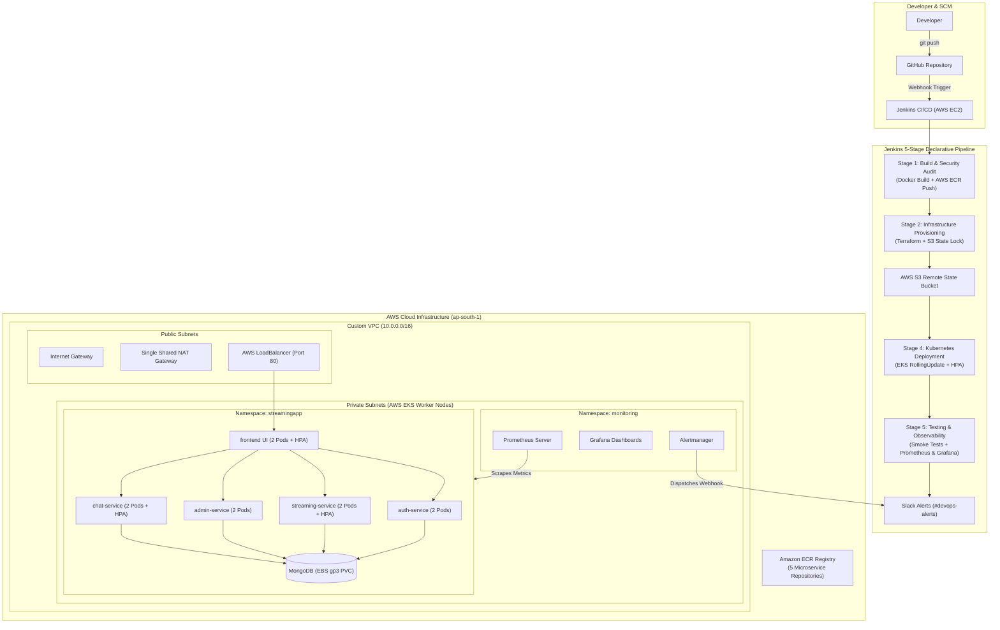

# 01. End-to-End System Architecture & Design

## 1. Executive Summary
This project implements a production-grade, highly available, and resilient **End-to-End DevOps CI/CD Pipeline** designed to build, package, test, provision, deploy, and monitor a multi-tier microservices streaming platform (**StreamingApp**) on **Amazon Elastic Kubernetes Service (AWS EKS)**.

The infrastructure and operational lifecycle are 100% automated using industry-standard tools:
*   **Infrastructure as Code (IaC):** HashiCorp Terraform
*   **Configuration Management:** Ansible
*   **Continuous Integration & Continuous Delivery (CI/CD):** Jenkins (Declarative Pipeline)
*   **Container Orchestration:** Kubernetes (AWS EKS v1.29)
*   **Container Registry:** Amazon Elastic Container Registry (ECR)
*   **Observability & Monitoring:** Prometheus, Grafana, Alertmanager

---

## 2. High-Level Architecture Diagram

---

## 3. Microservice Architectural Breakdown

The application is decomposed into five autonomous services communicating over internal Kubernetes ClusterIP networks:

| Microservice | Port | Tech Stack | Role & Responsibility |
| :--- | :--- | :--- | :--- |
| **`auth-service`** | `3001` | Node.js, Express, JWT, Bcrypt | User authentication, registration, password hashing, and token issuance. |
| **`streaming-service`** | `3002` | Node.js, Express, AWS S3 SDK | Video catalogue retrieval, S3 media stream URL generation, and metadata serving. |
| **`admin-service`** | `3003` | Node.js, Express, AWS S3 SDK | Administrative asset management, media ingestion, metadata curation, and signed upload URLs. |
| **`chat-service`** | `3004` | Node.js, Socket.IO, Express | Real-time WebSocket broadcasting and chat history persistence for live watch parties. |
| **`frontend`** | `80` | React.js, Nginx Alpine, TailwindCSS | Single Page Application (SPA) providing video browsing, streaming playback, and admin UI. |
| **`mongo`** | `27017` | MongoDB 6.0 Engine | Centralized document datastore with persistent volume claims (PVC) on AWS EBS. |

---

## 4. Multi-Layer Enterprise Security Architecture

Security is implemented following defense-in-depth principles across 5 distinct operational layers:

### 4.1 Network Isolation & Subnet Segregation
* **Isolated Private Subnets (`10.0.10.0/24`, `10.0.20.0/24`):** All AWS EKS worker nodes, microservice pods, and MongoDB database storage are located entirely within private subnets with **zero direct public IP assignments**.
* **Public Subnet Demarcation (`10.0.1.0/24`, `10.0.2.0/24`):** Only public ingress endpoints (AWS Network LoadBalancer) and egress routers (Single NAT Gateway) reside in public subnets.
* **Least-Privilege Security Groups:**
  * `eks-cluster-sg`: Restricts control-plane traffic exclusively to authorized worker node security groups.
  * `eks-nodes-sg`: Restricts inter-pod and container traffic strictly to internal VPC CIDR blocks (`10.0.0.0/16`) and required microservice ports.

### 4.2 Zero-Trust Identity & Access Management (IAM)
* **IAM Instance Profiles & STS Tokens:** EKS worker nodes and the Jenkins CI/CD controller authenticate to AWS services (ECR, S3, CloudWatch) using **AWS IAM Instance Profiles** (`streaming-platform-jenkins-instance-profile`) that issue temporary, auto-rotating STS tokens.
* **Zero Hardcoded Credentials:** No static AWS Access Keys (`AKIA...`) or passwords are committed to Git repositories or baked into Docker container images.

### 4.3 Ingress Protection & Nginx Reverse Proxy API Gateway
* **Internal Cluster Routing:** The React frontend container embeds an **Nginx reverse proxy** that routes API calls (`/api/auth/`, `/api/streaming/`, `/api/admin/`, `/api/chat/`) internally over Kubernetes DNS (`http://auth-service:3001`, etc.).
* **Zero Public Port Exposure:** Microservices (`:3001`, `:3002`, `:3003`, `:3004`) and MongoDB (`:27017`) remain private ClusterIP services, completely invisible to the public internet.

### 4.4 Kubernetes Workload Security
* **Encrypted Secrets Management:** Sensitive configuration items (MongoDB URIs, JWT signing keys) are stored in Kubernetes `Secret` resources encrypted in `etcd`.
* **Resource Limits & DoS Prevention:** Every container specifies explicit CPU and memory `requests` and `limits`, preventing "noisy-neighbor" resource starvation or denial-of-service conditions.
* **Namespace Isolation:** Workloads run inside dedicated, isolated Kubernetes namespaces (`streamingapp` and `monitoring`).

### 4.5 Pipeline DevSecOps & Automated Vulnerability Audits
* **Static Security Auditing:** Stage 1 of the Jenkins Declarative Pipeline executes automated vulnerability scans (`npm audit --audit-level=critical`) across all microservices before Docker image construction.
* **Immutable Container Tagging:** Docker images pushed to Amazon ECR are dual-tagged with immutable build numbers (`build-${BUILD_NUMBER}`) to guarantee artifact provenance and tamper prevention.

---

## 5. Architecture & Provisioning Evidence

### AWS VPC & Subnet Networking

### AWS EKS Cluster Provisioning

### Amazon ECR Container Repositories

### Kubernetes Worker Node Readiness

### Microservice Containerization (Docker Build)

### Local & Remote Docker Container Images

