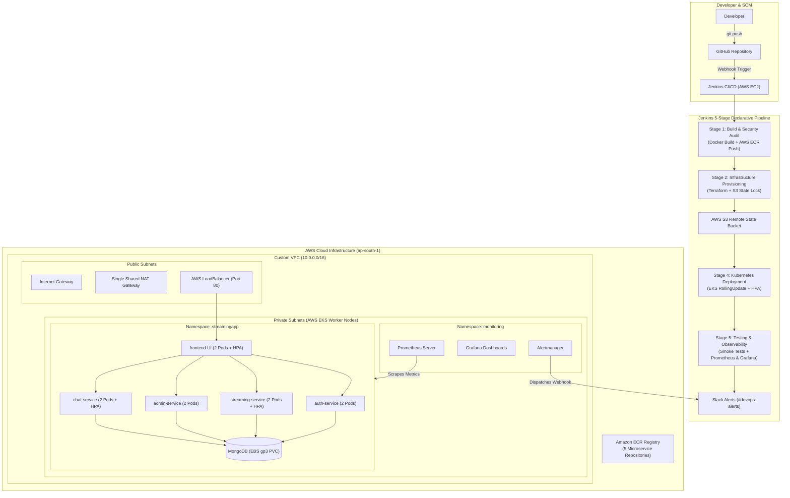
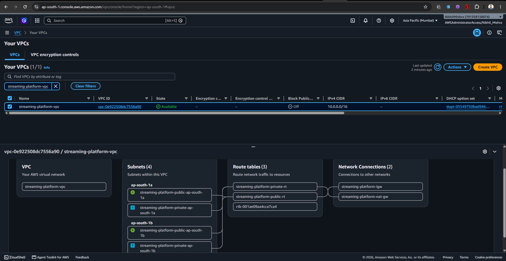
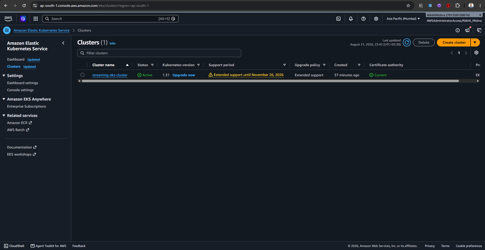
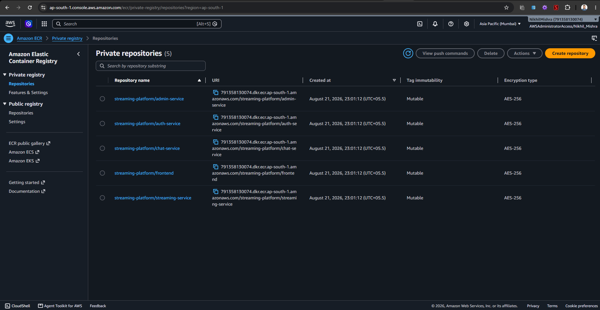
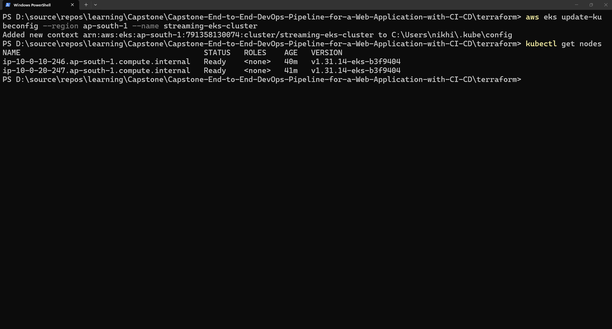
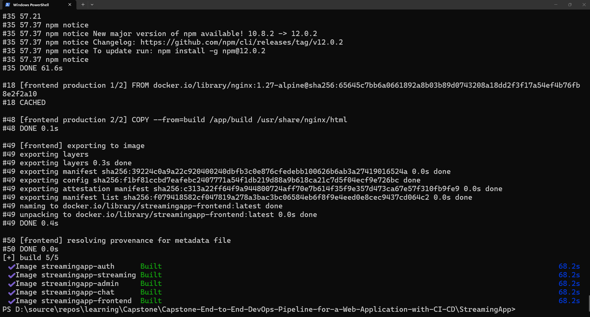
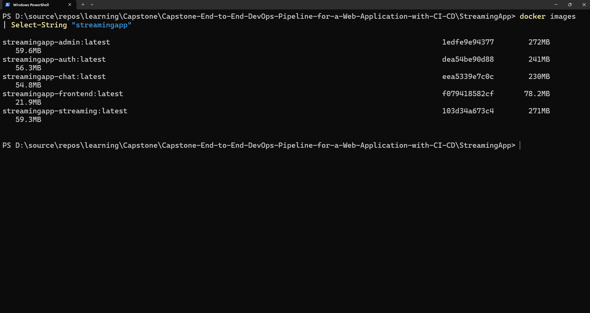

# 01. End-to-End System Architecture & Design

## 1. Executive Summary
This project implements a production-grade, highly available, and resilient **End-to-End DevOps CI/CD Pipeline** designed to build, package, test, provision, deploy, and monitor a multi-tier microservices streaming platform (**StreamingApp**) on **Amazon Elastic Kubernetes Service (AWS EKS)**.

The infrastructure and operational lifecycle are 100% automated using industry-standard tools:
*   **Infrastructure as Code (IaC):** HashiCorp Terraform
*   **Configuration Management:** Ansible
*   **Continuous Integration & Continuous Delivery (CI/CD):** Jenkins (Declarative Pipeline)
*   **Container Orchestration:** Kubernetes (AWS EKS v1.29)
*   **Container Registry:** Amazon Elastic Container Registry (ECR)
*   **Observability & Monitoring:** Prometheus, Grafana, Alertmanager

---

## 2. High-Level Architecture Diagram

---

## 3. Microservice Architectural Breakdown

The application is decomposed into five autonomous services communicating over internal Kubernetes ClusterIP networks:

| Microservice | Port | Tech Stack | Role & Responsibility |
| :--- | :--- | :--- | :--- |
| **`auth-service`** | `3001` | Node.js, Express, JWT, Bcrypt | User authentication, registration, password hashing, and token issuance. |
| **`streaming-service`** | `3002` | Node.js, Express, AWS S3 SDK | Video catalogue retrieval, S3 media stream URL generation, and metadata serving. |
| **`admin-service`** | `3003` | Node.js, Express, AWS S3 SDK | Administrative asset management, media ingestion, metadata curation, and signed upload URLs. |
| **`chat-service`** | `3004` | Node.js, Socket.IO, Express | Real-time WebSocket broadcasting and chat history persistence for live watch parties. |
| **`frontend`** | `80` | React.js, Nginx Alpine, TailwindCSS | Single Page Application (SPA) providing video browsing, streaming playback, and admin UI. |
| **`mongo`** | `27017` | MongoDB 6.0 Engine | Centralized document datastore with persistent volume claims (PVC) on AWS EBS. |

---

## 4. Network Security & Subnet Design

1.  **VPC Isolation:** A custom Virtual Private Cloud (`10.0.0.0/16`) spans two Availability Zones (`ap-south-1a`, `ap-south-1b`) for high availability.
2.  **Public Subnets (`10.0.1.0/24`, `10.0.2.0/24`):** Only internet-facing load balancers and the outbound NAT Gateway reside here.
3.  **Private Subnets (`10.0.10.0/24`, `10.0.20.0/24`):** EKS worker nodes and application workloads are isolated with zero direct public IP assignment. Outbound internet traffic (for pulling dependencies/patches) routes through the NAT Gateway.
4.  **Least Privilege Security Groups:**
    *   `eks-cluster-sg`: Restricts control plane communication strictly to authenticated worker node interfaces.
    *   `eks-nodes-sg`: Restricts inter-pod traffic to internal VPC CIDRs and required application ports.

---

## 5. Architecture & Provisioning Evidence

### AWS VPC & Subnet Networking

### AWS EKS Cluster Provisioning

### Amazon ECR Container Repositories

### Kubernetes Worker Node Readiness

### Microservice Containerization (Docker Build)

### Local & Remote Docker Container Images

