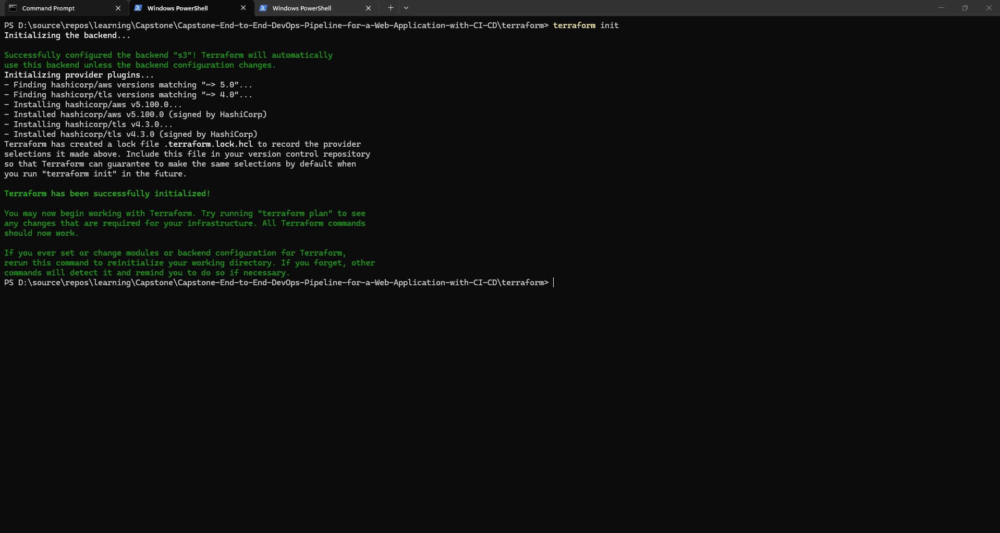
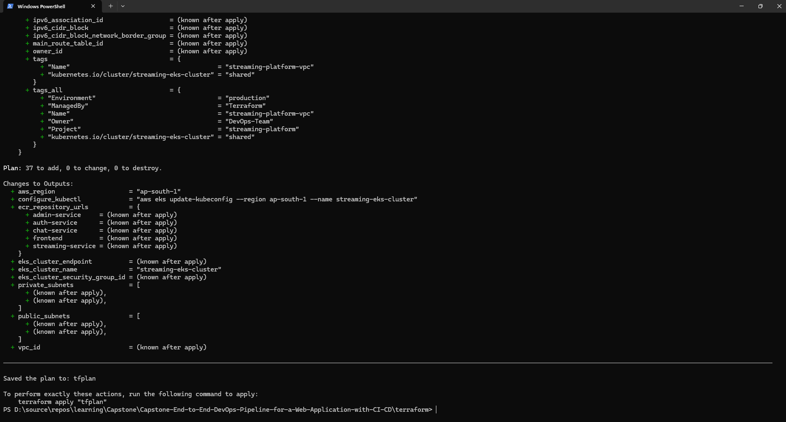
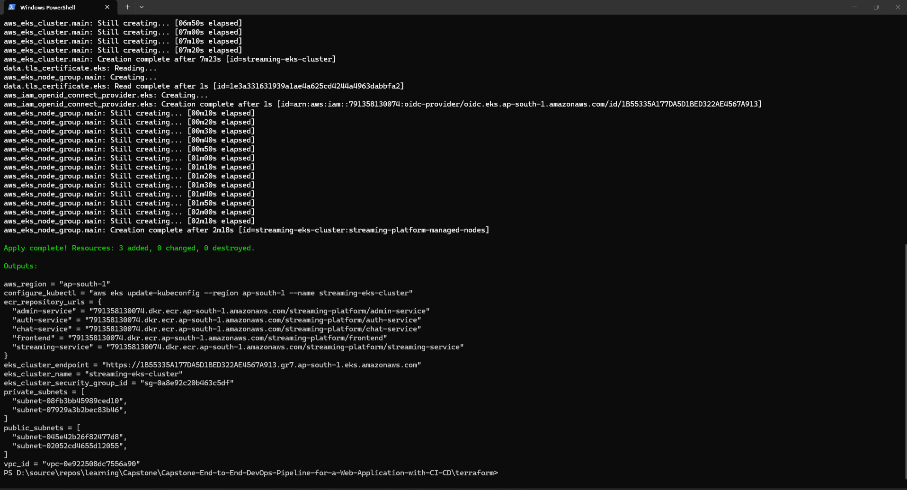

# 02. Infrastructure as Code (IaC) Guide with Terraform

## 1. Overview
The infrastructure layer is fully codified using **HashiCorp Terraform (v1.5+)**. It automates the provisioning of:
*   AWS VPC, Internet Gateway, NAT Gateway, Public/Private Subnets, and Route Tables.
*   AWS EKS Control Plane (v1.29) and Managed Node Groups (`t3.medium`).
*   IAM Roles and Policy Attachments for EKS control plane and worker nodes.
*   OpenID Connect (OIDC) Identity Provider for IRSA.
*   Amazon ECR Repositories with cost-effective lifecycle cleanup rules.

---

## 2. Directory Structure
```
terraform/
├── backend.tf               # S3 Remote state and DynamoDB lock configuration
├── provider.tf              # AWS provider definition and default project tags
├── variables.tf             # Configurable input variables
├── terraform.tfvars.example # Sample variable value overrides
├── vpc.tf                   # VPC, Subnets, Gateways, and Route Tables
├── security_groups.tf       # EKS cluster and node security groups
├── eks.tf                   # EKS Cluster, Node Group, IAM, and OIDC Provider
├── ecr.tf                   # ECR Repositories and lifecycle retention rules
├── jenkins_ec2.tf           # Jenkins CI/CD Controller EC2 instance, EIP, and IAM Role
├── outputs.tf               # Exported resource IDs, endpoints, and commands
└── scripts/
    ├── teardown.sh          # Fast bash teardown script
    └── teardown.bat         # Fast batch teardown script
```

---

## 3. Step-by-Step Provisioning Instructions

### Step 1: Configure AWS CLI Credentials
Ensure your AWS CLI is authenticated with an IAM user or role with Administrator/EKS permissions:
```bash
aws configure
# Enter AWS Access Key ID, Secret Access Key, Region (e.g. ap-south-1), and Output format (json)
```

### Step 2: Initialize Terraform Working Directory
Navigate to the `terraform/` folder and download required provider plugins:
```bash
cd terraform
terraform init
```



### Step 3: Validate and Format Configuration Files
```bash
terraform fmt
terraform validate
```

### Step 4: Generate Execution Plan
```bash
terraform plan -out=tfplan
```
*Review the resources to be created (approx. 35-40 AWS resources).*



### Step 5: Apply Execution Plan
```bash
terraform apply tfplan
```
*(Provisioning creates VPC, EKS, ECR repositories, and the dedicated Jenkins EC2 controller).*



### Step 6: Configure Local Kubectl Access
Once Terraform completes, retrieve the `configure_kubectl` output command or run:
```bash
aws eks update-kubeconfig --region ap-south-1 --name streaming-eks-cluster
kubectl get nodes
```

---

## 4. Terraform Outputs Reference
| Output Variable | Description |
| :--- | :--- |
| `vpc_id` | ID of the created VPC |
| `public_subnets` | List of public subnet IDs |
| `private_subnets` | List of private subnet IDs |
| `eks_cluster_name` | Name of the EKS Cluster (`streaming-eks-cluster`) |
| `eks_cluster_endpoint`| Kubernetes API Server HTTPS endpoint |
| `ecr_repository_urls` | Map of repository URIs for each of the 5 microservices |
| `jenkins_public_ip` | Static Elastic IP of the Jenkins Controller EC2 instance |
| `jenkins_url` | Web Console URL for Jenkins Server (`http://<EIP>:8080`) |
| `configure_kubectl` | Exact command to authenticate `kubectl` with the cluster |
