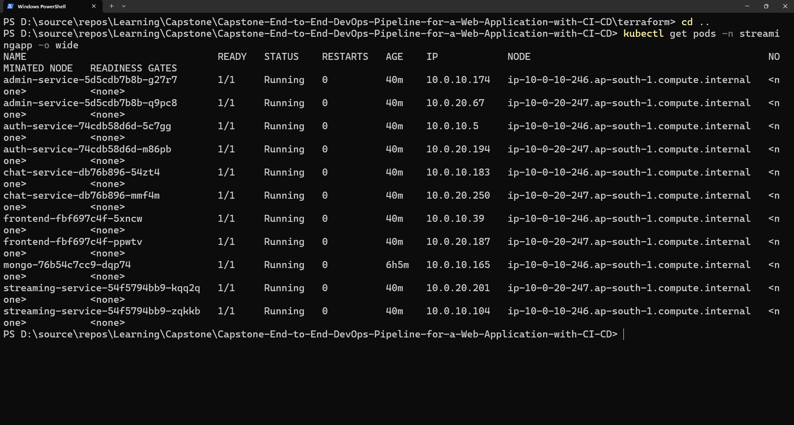
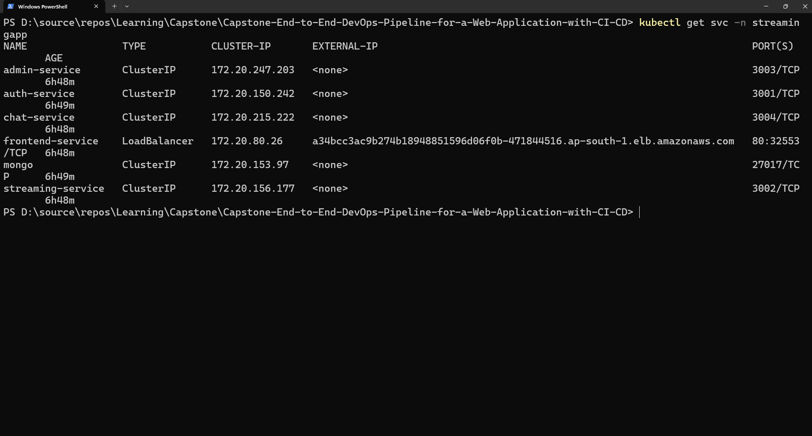
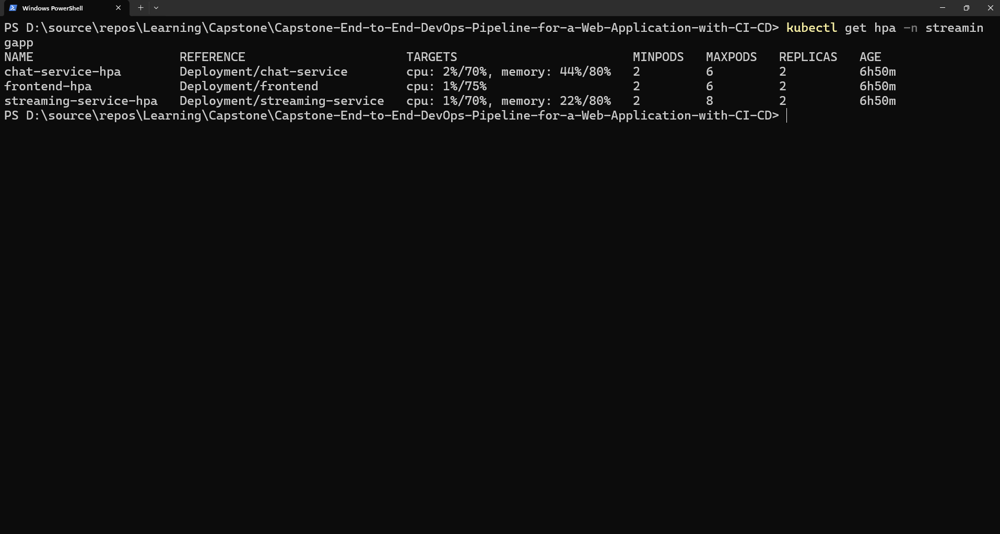

# 04. Kubernetes Microservices Orchestration on AWS EKS

## 1. Overview
The microservices platform is deployed into a dedicated `streamingapp` namespace on AWS EKS. The deployment is architected for zero-downtime rolling updates, high availability, persistent data storage, and automated horizontal autoscaling.

---

## 2. Manifests & Workload Inventory

```
k8s/
├── 00-namespace.yaml            # Isolated namespace 'streamingapp'
├── 01-configmaps-secrets.yaml   # Environment variables and base64 encoded secrets
├── 02-mongodb.yaml              # MongoDB deployment, PVC (10Gi gp3), and ClusterIP
├── 03-auth-service.yaml         # Auth Microservice (Replicas: 2, Probes, Resources)
├── 04-streaming-service.yaml    # Streaming Microservice (Replicas: 2, S3 Integration)
├── 05-admin-service.yaml        # Admin Microservice (Replicas: 2, Probes, Resources)
├── 06-chat-service.yaml         # Chat Microservice (Replicas: 2, WebSocket support)
├── 07-frontend.yaml             # React SPA (Replicas: 2, AWS Network LoadBalancer)
├── 08-ingress.yaml              # AWS ALB Ingress Controller routing rules
└── 09-hpa.yaml                  # Horizontal Pod Autoscalers (Target: 70% CPU)
```

---

## 3. Key Kubernetes Architectural Features

### 1. High Availability & Zero-Downtime Deployments
All microservice deployments utilize a `RollingUpdate` strategy with:
*   `maxSurge: 1` (Spins up a new pod before tearing down old pods)
*   `maxUnavailable: 0` (Guarantees zero dropped connections during deployment)

### 2. Self-Healing & Health Probing
Every container is configured with dual probes:
*   **Liveness Probe:** Periodically checks container health on `/api/health`. If a deadlock occurs, Kubernetes automatically restarts the unhealthy container.
*   **Readiness Probe:** Ensures a newly created pod only receives live user traffic after its database connections and server ports are fully initialized.

### 3. Persistent Data Storage
MongoDB is backed by a 10Gi `PersistentVolumeClaim` dynamically provisioned via AWS Elastic Block Store (EBS `gp3` / `gp2`). Even if the MongoDB pod restarts or reschedules to another node, data integrity is preserved.

### 4. Horizontal Pod Autoscaling (HPA)
Traffic-heavy services (`streaming-service`, `chat-service`, and `frontend`) are equipped with HPAs that dynamically scale replicas between **2 and 8 pods** whenever CPU utilization exceeds **70%**.

---

## 4. Manual Deployment & Verification Commands

```bash
# 1. Ensure Kubeconfig is active
aws eks update-kubeconfig --region ap-south-1 --name streaming-eks-cluster

# 2. Apply all manifests in sequence
kubectl apply -f k8s/00-namespace.yaml
kubectl apply -f k8s/01-configmaps-secrets.yaml
kubectl apply -f k8s/02-mongodb.yaml
kubectl apply -f k8s/03-auth-service.yaml
kubectl apply -f k8s/04-streaming-service.yaml
kubectl apply -f k8s/05-admin-service.yaml
kubectl apply -f k8s/06-chat-service.yaml
kubectl apply -f k8s/07-frontend.yaml
kubectl apply -f k8s/09-hpa.yaml

# 3. Verify Rollouts
kubectl get pods -n streamingapp -o wide
kubectl get svc -n streamingapp
kubectl get hpa -n streamingapp
```

### Deployment Evidence








