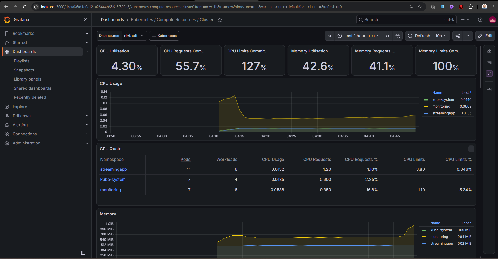
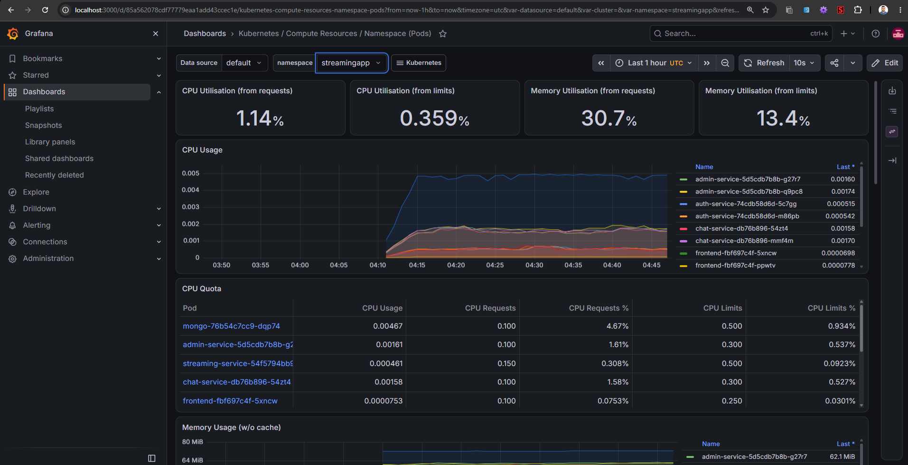
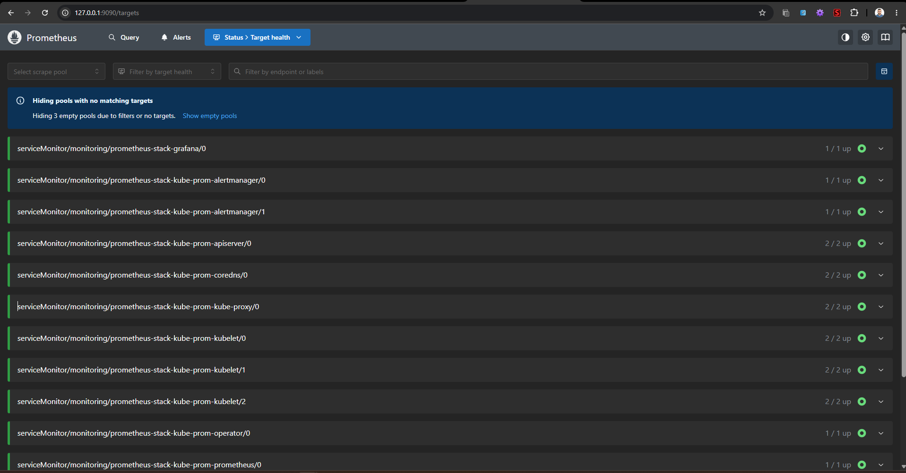

# 06. Observability, Monitoring & Alerting

## 1. Overview
Full-stack observability is achieved using **Prometheus**, **Grafana**, and **Alertmanager** deployed via Helm (`kube-prometheus-stack`). The stack provides real-time metrics collection, interactive visual dashboards, and proactive alerts for infrastructure and application anomalies.

---

## 2. Monitoring Architecture
```
[ Kubernetes Nodes (Node Exporter) ] ──┐
[ Kubernetes API (Kube-State-Metrics) ]─┼──> [ Prometheus Server ] ──> [ Grafana Dashboard (Port 3000) ]
[ Microservice Pods (/api/health) ] ───┘             │
                                                     ▼
                                             [ Alertmanager ] ──> [ Slack / Teams Webhook ]
```

---

## 3. Step-by-Step Deployment

Run the automated installer script:
```bash
# Linux / macOS
cd monitoring
./install-monitoring.sh

# Windows
cd monitoring
install-monitoring.bat
```

Or execute via Helm CLI manually:
```bash
helm repo add prometheus-community https://prometheus-community.github.io/helm-charts
helm repo update
helm upgrade --install prometheus-stack prometheus-community/kube-prometheus-stack \
  --namespace monitoring \
  --create-namespace \
  --values monitoring/helm-values-prometheus.yaml

kubectl apply -f monitoring/custom-alerts.yaml
```

---

## 4. Accessing Grafana Dashboards
Expose Grafana locally via Kubernetes port-forwarding:
```bash
kubectl port-forward -n monitoring svc/prometheus-stack-grafana 3000:80
```
*   **URL:** `http://localhost:3000`
*   **Username:** `admin`
*   **Password:** `admin-secure-password`

### Pre-loaded Dashboards:
1.  **Kubernetes / Compute Resources / Cluster:** Overall CPU, Memory, and Pod allocations.
2.  **Kubernetes / Compute Resources / Namespace (Pods):** Granular metrics for `streamingapp` pods.
3.  **Node Exporter / Nodes:** Hardware performance of the underlying AWS EC2 worker instances.

### Monitoring Evidence







---

## 5. Custom Alerting Rules

The system includes pre-configured alerting rules in `monitoring/custom-alerts.yaml`:

| Alert Name | Severity | Condition | Threshold |
| :--- | :--- | :--- | :--- |
| **`HighPodCpuUsage`** | Warning | Container CPU vs Limit | `> 80%` for 5 consecutive minutes |
| **`HighPodMemoryUsage`** | Warning | Container Memory vs Limit | `> 85%` for 5 consecutive minutes |
| **`PodCrashLooping`** | Critical | Pod Restarts Count | `> 3 restarts` in 5 minutes |
| **`KubernetesNodeNotReady`**| Critical | Node Readiness Status | `Condition != Ready` for 5 minutes |
