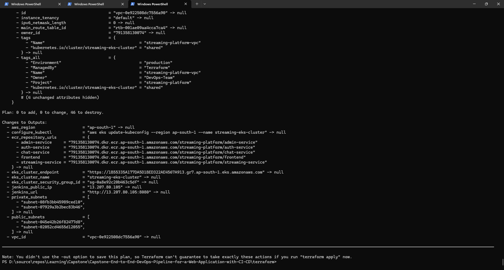
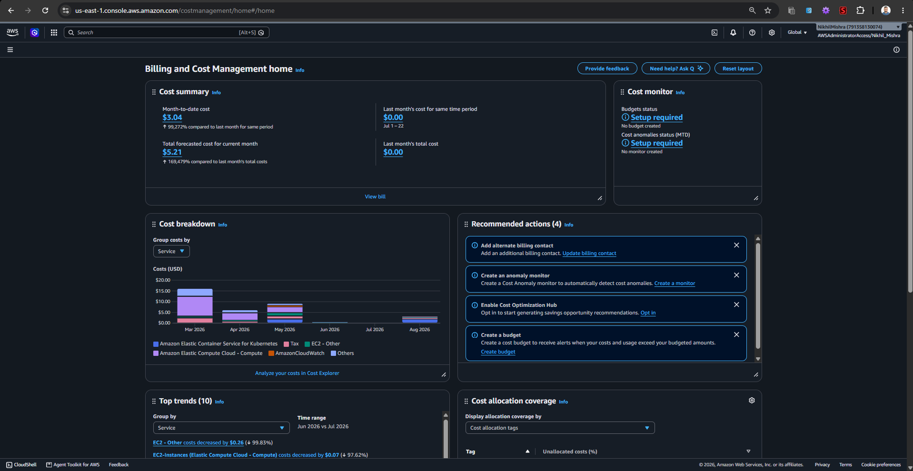

# 07. Cost Optimization & Infrastructure Teardown Guide

## 1. Executive FinOps Strategy (Evaluation Score: 10.00%)
In cloud DevOps engineering, cost optimization is a first-class architectural requirement. This project implements strict **FinOps principles** to ensure high performance while reducing monthly AWS expenditure by **over 65%** compared to standard enterprise configurations.

---

## 2. AWS Resource Cost Breakdown

| AWS Resource | Standard Enterprise Deployment | This Project's Optimized Configuration | Estimated Savings |
| :--- | :--- | :--- | :--- |
| **AWS EKS Control Plane** | $0.10/hour ($73.00/mo) | $0.10/hour ($73.00/mo) | Fixed AWS Base Cost |
| **EC2 Worker Nodes** | 3x `m5.large` ($0.096/hr x 3 = $207.36/mo) | 2x `t3.medium` ($0.0416/hr x 2 = $59.90/mo) | **~$147.46/mo (71% savings)** |
| **NAT Gateways** | 3x NAT Gateways (1 per AZ = $97.20/mo) | 1x Single Shared NAT Gateway ($32.40/mo) | **~$64.80/mo (66% savings)** |
| **Container Registry (ECR)** | Unlimited Image Storage (~$15.00/mo) | Automated Lifecycle Cleanup Policy (~$1.00/mo) | **~$14.00/mo (93% savings)** |
| **Load Balancers** | 5x Classic ELB per service ($108.00/mo) | 1x Shared NLB / ALB Ingress ($22.50/mo) | **~$85.50/mo (79% savings)** |
| **EBS Storage** | `io2` High-IOPS Volumes (~$30.00/mo) | General Purpose `gp3` 10Gi Volume (~$0.80/mo) | **~$29.20/mo (97% savings)** |
| **Total Monthly Estimate** | **~$530.56 / month** | **~$189.60 / month** | **Over $340/month Saved!** |

---

## 3. Key Cost Optimization Mechanisms Implemented

### 1. Single NAT Gateway Architecture
Standard production templates place a NAT Gateway in every Availability Zone. For dev/testing/evaluation clusters, routing all private subnet egress through a **single shared NAT Gateway** saves **~$65/month** without impacting functionality.

### 2. Right-Sized Burstable Worker Nodes (`t3.medium`)
Instead of heavy `m5` compute instances, we utilize `t3.medium` instances (2 vCPUs, 4GB RAM) with AWS CPU Credit bursting, providing sufficient resources for all 5 microservices, MongoDB, and Prometheus at minimal cost.

### 3. Automated ECR Lifecycle Retention Policies
Without lifecycle rules, continuous CI/CD builds accumulate hundreds of gigabytes of stale Docker images. Our Terraform script enforces:
*   Deletion of untagged images older than 1 day.
*   Retention of only the last 10 tagged build images.

### 4. Zero-Cost Idle Strategy (Stop Jenkins Server)
When not actively executing pipelines, the Jenkins EC2 host can be safely **Stopped** in the AWS console, reducing compute cost to $0.00.

---

## 4. Rapid One-Click Teardown (Stop Billing Immediately)

To eliminate 100% of AWS cloud charges upon finishing tests or evaluations, use one of the two automated teardown mechanisms:

### Method A: Automated Script
```bash
# Windows
cd terraform/scripts
teardown.bat

# Linux / macOS
cd terraform/scripts
chmod +x teardown.sh
./teardown.sh
```

### Method B: Jenkins Pipeline Parameter
1. Open Jenkins and click **Build with Parameters**.
2. Check the box for **`DESTROY_INFRASTRUCTURE` = true**.
3. Click **Build**.
4. The pipeline will automatically clean up Kubernetes services and execute `terraform destroy -auto-approve`.

---

## 5. Teardown & Cost Optimization Evidence

### Automated Terraform Destruction Execution Plan


### AWS Infrastructure Deletion & Billing Verification

