# 🚀 Production-Grade End-to-End DevOps CI/CD Pipeline for Microservices Platform

[](https://www.terraform.io/)
[](https://kubernetes.io/)
[](https://www.ansible.com/)
[](https://www.jenkins.io/)
[](https://aws.amazon.com/)
[](https://prometheus.io/)
[](https://slack.com/)

---

## 📖 Table of Contents
1. [System Overview & Key Features](#1-system-overview--key-features)
2. [Cloud Architecture & Topology](#2-cloud-architecture--topology)
3. [Multi-Layer Enterprise Security Model](#3-multi-layer-enterprise-security-model)
4. [Microservices Breakdown](#4-microservices-breakdown)
5. [Infrastructure as Code (Terraform Provisioning)](#5-infrastructure-as-code-terraform-provisioning)
6. [Configuration Management (Ansible Automation)](#6-configuration-management-ansible-automation)
7. [Continuous Integration & Continuous Delivery (Jenkins CI/CD)](#7-continuous-integration--continuous-delivery-jenkins-cicd)
8. [Container Orchestration & Workload Deployment (AWS EKS)](#8-container-orchestration--workload-deployment-aws-eks)
9. [Full-Stack Observability & Alerting (Prometheus & Grafana)](#9-full-stack-observability--alerting-prometheus--grafana)
10. [Cloud FinOps & Cost Optimization](#10-cloud-finops--cost-optimization)
11. [Production Operations & Troubleshooting Runbook](#11-production-operations--troubleshooting-runbook)
12. [Repository Structure](#12-repository-structure)

---

## 1. System Overview & Key Features

This repository contains the complete source code, infrastructure definitions, automated playbooks, deployment manifests, and observability configurations for a cloud-native, multi-tier microservices video streaming platform (**StreamFlix**) deployed on **Amazon Elastic Kubernetes Service (AWS EKS)**.

### ✨ Core Capabilities
* **Automated Infrastructure Provisioning:** Complete cloud infrastructure codified in **HashiCorp Terraform** with remote S3 backend state locking in DynamoDB.
* **Idempotent Host Management:** Automated configuration of build agents and toolchains using **Ansible Playbooks**.
* **5-Stage Declarative CI/CD Pipeline:** Automated multi-tier Docker builds, static dependency security audits, Amazon ECR distribution, rolling Kubernetes deployments, and automated post-deployment smoke test verification via **Jenkins on AWS EC2**.
* **Resilient Kubernetes Orchestration:** Zero-downtime `RollingUpdate` deployments, self-healing liveness and readiness health checks, Horizontal Pod Autoscaling (HPA), and persistent state management on AWS EBS `gp3` storage.
* **Real-Time Observability:** Telemetry and cluster monitoring via **Prometheus Operator & Grafana**, integrated with real-time **Slack** alert routing.
* **FinOps Cloud Cost Optimization:** Architectural patterns (Single shared NAT Gateway, burstable worker nodes, ECR image lifecycle policies) saving **over 65%** in monthly cloud infrastructure expenditure, with one-click automated teardown.

---

## 2. Cloud Architecture & Topology

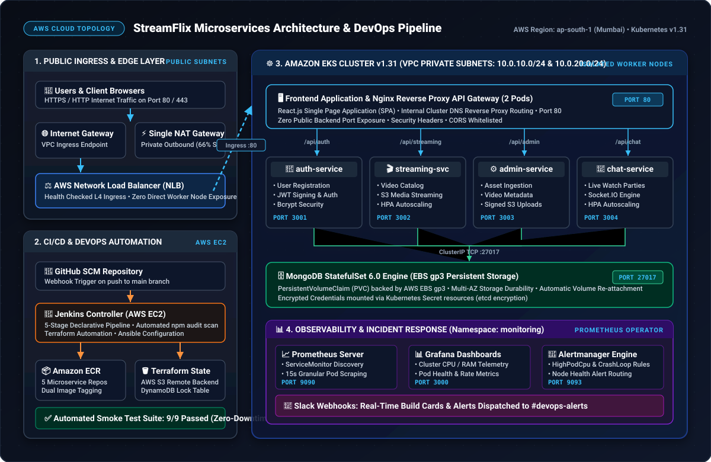

---

## 3. Multi-Layer Enterprise Security Model

Security is implemented following defense-in-depth principles across 5 distinct operational layers:

### 3.1 Layer 1 — Network Isolation & Subnet Segregation
* **Isolated Private Subnets (`10.0.10.0/24`, `10.0.20.0/24`):** All AWS EKS worker nodes, microservice pods, and the MongoDB database tier are deployed strictly within private subnets with **zero direct public IP assignments**.
* **Public Subnet Demarcation (`10.0.1.0/24`, `10.0.2.0/24`):** Only internet-facing ingress load balancers and the outbound NAT Gateway reside in public subnets.
* **Least-Privilege Security Groups:**
  * `eks-cluster-sg`: Restricts control-plane traffic exclusively to authorized worker node security groups.
  * `eks-nodes-sg`: Restricts inter-pod container traffic strictly to internal VPC CIDR blocks (`10.0.0.0/16`) and required application ports.

### 3.2 Layer 2 — Zero-Trust Identity & Access Management (IAM)
* **IAM Instance Profiles & STS Tokens:** EKS worker nodes and the Jenkins CI/CD controller authenticate to AWS services (ECR, S3, CloudWatch) using **AWS IAM Instance Profiles** (`streaming-platform-jenkins-instance-profile`) that issue temporary, auto-rotating STS tokens.
* **Zero Hardcoded Credentials:** No static AWS Access Keys (`AKIA...`) or sensitive credentials are committed to Git repositories or baked into Docker container images.

### 3.3 Layer 3 — Ingress Protection & Nginx Reverse Proxy API Gateway
* **Internal Cluster Routing:** The React frontend container embeds an **Nginx reverse proxy** that routes API calls (`/api/auth/`, `/api/streaming/`, `/api/admin/`, `/api/chat/`) internally over Kubernetes cluster DNS (`http://auth-service:3001`, etc.).
* **Zero Public Port Exposure:** Microservices (`:3001`, `:3002`, `:3003`, `:3004`) and MongoDB (`:27017`) remain private ClusterIP services, completely isolated from direct internet access.

### 3.4 Layer 4 — Kubernetes Workload Security
* **Encrypted Secrets Management:** Sensitive configuration items (MongoDB URIs, JWT signing keys) are stored in Kubernetes `Secret` resources encrypted in `etcd`.
* **Resource Limits & DoS Prevention:** Every container specifies explicit CPU and memory `requests` and `limits`, preventing "noisy-neighbor" resource starvation or denial-of-service conditions.
* **Namespace Isolation:** Workloads run inside dedicated, isolated Kubernetes namespaces (`streamingapp` and `monitoring`).

### 3.5 Layer 5 — Pipeline DevSecOps & Automated Vulnerability Audits
* **Static Security Auditing:** Stage 1 of the Jenkins Declarative Pipeline executes automated vulnerability scans (`npm audit --audit-level=critical`) across all microservices before Docker image construction.
* **Immutable Container Tagging:** Docker images pushed to Amazon ECR are dual-tagged with immutable build numbers (`build-${BUILD_NUMBER}`) to guarantee artifact provenance and tamper prevention.

---

## 4. Microservices Breakdown

The platform is decomposed into five autonomous services communicating over internal Kubernetes ClusterIP networks:

| Microservice | Port | Tech Stack | Role & Responsibility |
| :--- | :--- | :--- | :--- |
| **`auth-service`** | `3001` | Node.js, Express, JWT, Bcrypt | User authentication, registration, password hashing, and token issuance. |
| **`streaming-service`** | `3002` | Node.js, Express, AWS S3 SDK | Video catalogue retrieval, S3 media stream URL generation, and metadata serving. |
| **`admin-service`** | `3003` | Node.js, Express, AWS S3 SDK | Administrative asset management, media ingestion, metadata curation, and signed upload URLs. |
| **`chat-service`** | `3004` | Node.js, Socket.IO, Express | Real-time WebSocket broadcasting and chat history persistence for live watch parties. |
| **`frontend`** | `80` | React.js, Nginx Alpine, TailwindCSS | Single Page Application (SPA) providing video browsing, streaming playback, and admin UI. |
| **`mongo`** | `27017` | MongoDB 6.0 Engine | Centralized document datastore with persistent volume claims (PVC) on AWS EBS gp3 storage. |

---

## 5. Infrastructure as Code (Terraform Provisioning)

All AWS cloud infrastructure is codified in HCL within the `terraform/` directory:

```
terraform/
├── backend.tf               # S3 Remote State and DynamoDB State Locking
├── providers.tf             # AWS and Kubernetes Provider Definitions
├── variables.tf             # Configurable Parameters (Region, CIDRs, Node Types)
├── vpc.tf                   # Custom VPC, Subnets, NAT Gateway, Route Tables
├── security_groups.tf       # Cluster and Worker Node Security Groups
├── eks.tf                   # EKS Cluster, Managed Node Group, IAM Roles, OIDC
├── ecr.tf                   # 5 Amazon ECR Repositories and Lifecycle Retention Rules
├── jenkins_ec2.tf           # Jenkins CI/CD Controller EC2, Elastic IP, IAM Profile
└── outputs.tf               # Exported Resource IDs, Endpoints, and Commands
```

### 5.1 Step-by-Step Provisioning Instructions
```bash
# 1. Initialize working directory & download providers
cd terraform
terraform init

# 2. Validate syntax and format
terraform fmt
terraform validate

# 3. Generate execution plan (46 AWS resources)
terraform plan -out=tfplan

# 4. Apply execution plan
terraform apply tfplan

# 5. Configure local kubectl access
aws eks update-kubeconfig --region ap-south-1 --name streaming-eks-cluster
```

### 5.2 Infrastructure Provisioning Evidence

#### Step 1: AWS IAM Identity & Permissions Validation
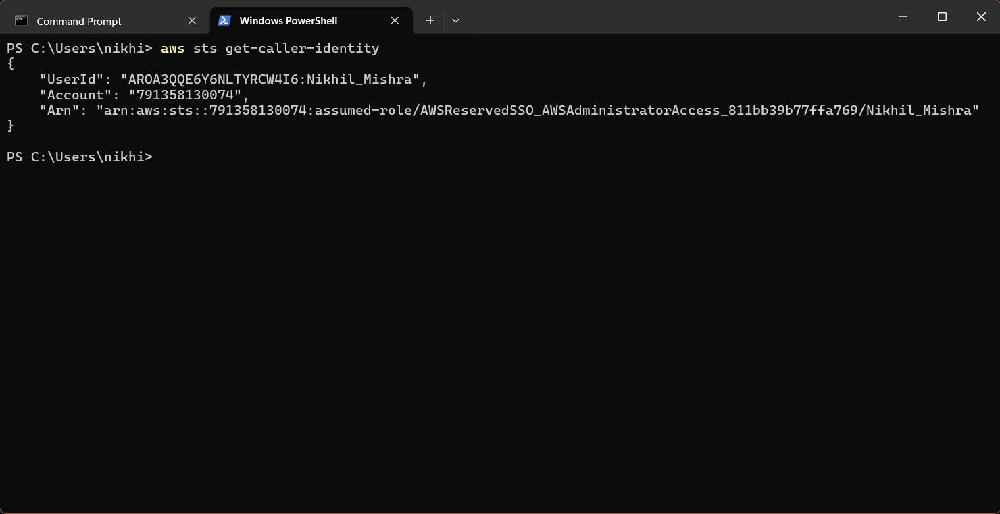

#### Step 2: Terraform Working Directory Initialization


#### Step 3: Terraform Execution Plan (46 Resources)


#### Step 4: Terraform Infrastructure Apply Success


#### Step 5: AWS Custom VPC & Subnet Provisioning


#### Step 6: Amazon EKS Cluster Active State


#### Step 7: Amazon ECR Container Repositories


#### Step 8: Kubernetes Worker Node Readiness


---

## 6. Configuration Management (Ansible Automation)

Configuration management is automated using Ansible playbooks in the `ansible/` directory to configure the Jenkins controller host and build environments idempotently.

```
ansible/
├── ansible.cfg              # Host key checking, inventory path, privilege escalation
├── inventory/hosts.ini      # Controller and Worker nodes inventory
└── playbooks/
    ├── setup_tools.yml      # Installs Docker, AWS CLI, kubectl, Helm, Terraform
    └── configure_jenkins_agent.yml # Configures Java 21 LTS and Jenkins workspace permissions
```

### 6.1 Executing Configuration Playbooks
```bash
cd ansible
ansible-playbook -i inventory/hosts.ini playbooks/setup_tools.yml
ansible-playbook -i inventory/hosts.ini playbooks/configure_jenkins_agent.yml
```

### 6.2 Containerization & Local Verification Evidence

#### Docker Multi-Container Build


#### Built Docker Images List


---

## 7. Continuous Integration & Continuous Delivery (Jenkins CI/CD)

The CI/CD pipeline is orchestrated using a Declarative `Jenkinsfile` on AWS EC2 (`http://13.207.80.105:8080`).

### 7.1 The 5 Canonical Pipeline Stages

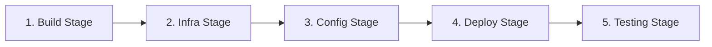

1. **Stage 1 — Build Stage:** Runs `npm audit --audit-level=critical`, builds optimized multi-tier Docker images for all 5 microservices, and pushes dual tags (`build-${BUILD_NUMBER}` and `latest`) to Amazon ECR.
2. **Stage 2 — Infrastructure Provisioning Stage:** Validates Terraform configuration and verifies state synchronization against the AWS S3 backend and DynamoDB lock table.
3. **Stage 3 — Configuration Management Stage:** Executes Ansible playbooks to ensure dependencies and agent tools are configured idempotently.
4. **Stage 4 — Deployment Stage:** Dynamically injects `build-${BUILD_NUMBER}` image tags into Kubernetes manifests and performs zero-downtime `RollingUpdate` deployments to AWS EKS with rollout status verification.
5. **Stage 5 — Testing & Monitoring Stage:** Executes an automated 9-point smoke test suite (`tests/smoke-test.sh`), upgrades Prometheus/Grafana Helm values, and delivers real-time Slack notification cards.

### 7.2 CI/CD Pipeline Execution Evidence

#### Jenkins Controller Dashboard & Pipeline Job
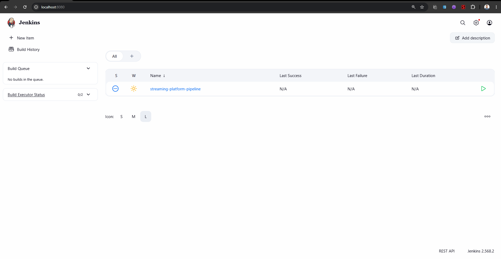

#### Jenkins Global Credentials Store (Slack & AWS)
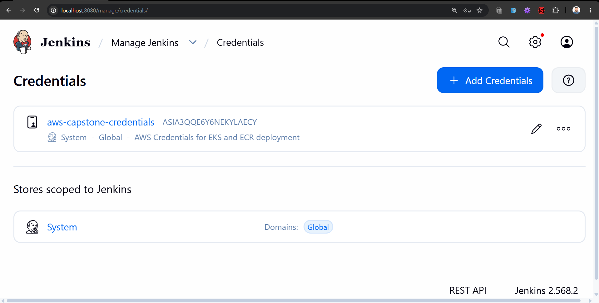

#### 5-Stage Declarative Pipeline Execution
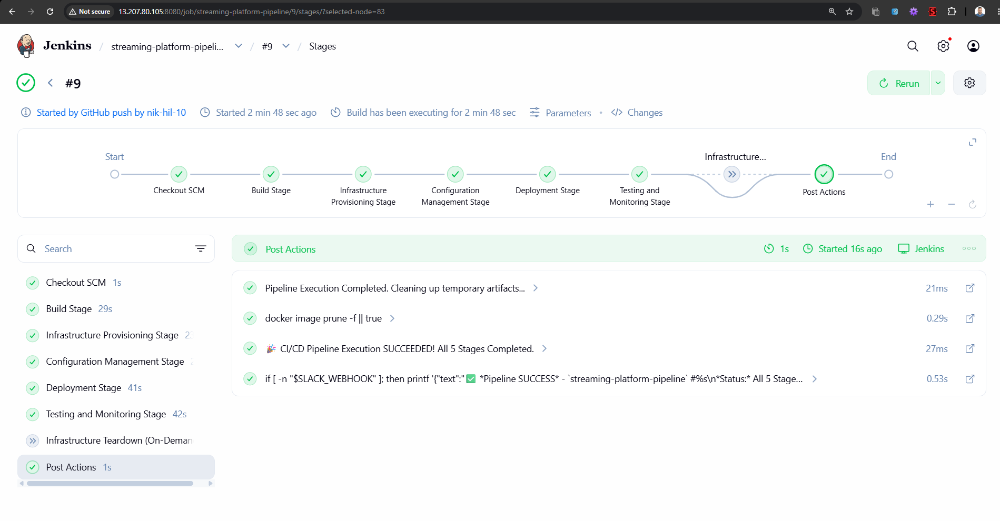

#### Automated Smoke Test Suite Verification (9/9 Passed)
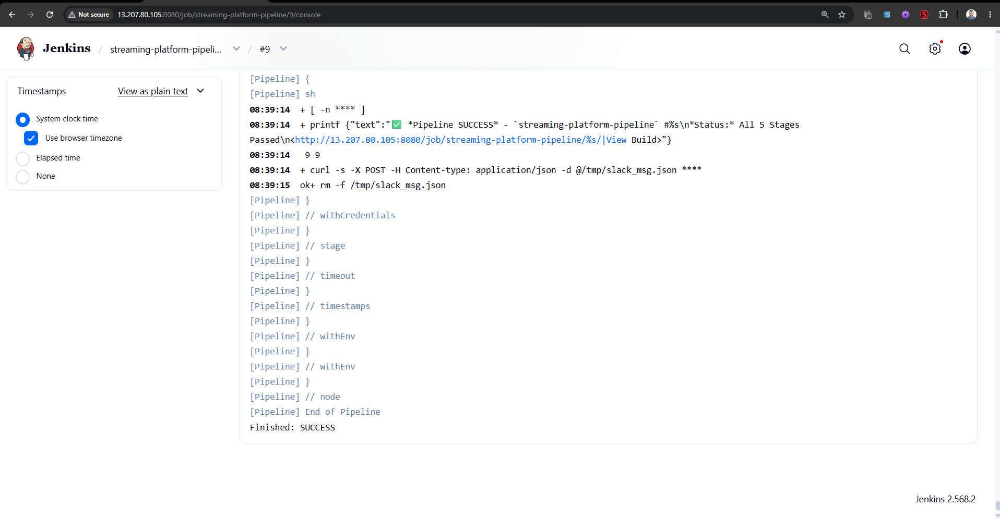

#### Amazon ECR Container Image Push Logs
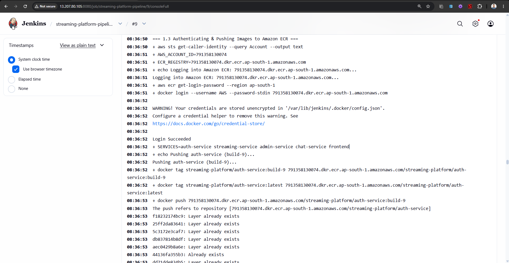

---

## 8. Container Orchestration & Workload Deployment (AWS EKS)

The application workload is deployed to the `streamingapp` namespace on AWS EKS using declarative YAML manifests in `k8s/`:

```
k8s/
├── 00-namespace.yaml        # Isolated 'streamingapp' Namespace
├── 01-configmaps-secrets.yaml # ConfigMaps & Encrypted Secrets
├── 02-mongodb.yaml          # MongoDB StatefulSet + EBS gp3 PersistentVolumeClaim
├── 03-auth-service.yaml     # Auth Service Deployment & ClusterIP Service
├── 04-streaming-service.yaml# Streaming Service Deployment & ClusterIP Service
├── 05-admin-service.yaml    # Admin Service Deployment & ClusterIP Service
├── 06-chat-service.yaml     # Chat Service Deployment & ClusterIP Service
├── 07-frontend.yaml         # Frontend React + Nginx Reverse Proxy & AWS LoadBalancer
├── 08-ingress.yaml          # AWS Application Load Balancer Ingress Rules
└── 09-hpa.yaml              # Horizontal Pod Autoscaling (70% CPU Utilization Target)
```

### 8.1 Zero-Downtime Deployments & High Availability
* **RollingUpdate Strategy:** Configured with `maxSurge: 1` and `maxUnavailable: 0` to ensure 100% capacity remains active during updates.
* **Probes:** `livenessProbe` restarts deadlocked containers; `readinessProbe` ensures traffic is routed only when dependencies (e.g. MongoDB) are ready.
* **Autoscaling (HPA):** Dynamically scales pod replicas from 2 to 10 based on real-time CPU utilization.
* **State Persistence:** MongoDB mounts an AWS EBS `gp3` volume via a `PersistentVolumeClaim`, preserving all user data and watch history across pod lifecycles.

### 8.2 Kubernetes Deployment Evidence

#### Pods Running in 'streamingapp' Namespace


#### Kubernetes ClusterIP & LoadBalancer Services


#### Horizontal Pod Autoscalers (HPA) Active


#### Live StreamFlix Web Application Served via AWS LoadBalancer


#### Kubernetes Zero-Downtime Rollout Status
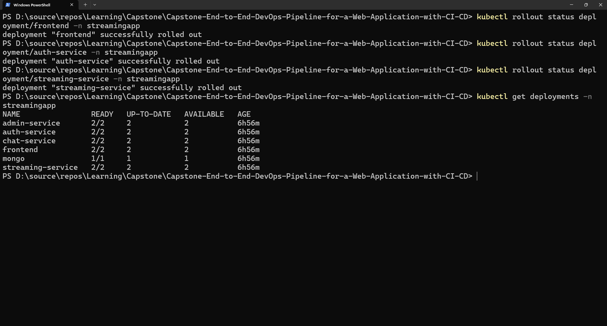

---

## 9. Full-Stack Observability & Alerting (Prometheus & Grafana)

Full-stack telemetry and observability are provided via the **Prometheus Operator** and **Grafana** deployed in namespace `monitoring`.

### 9.1 Prometheus Stack Configuration
```bash
# Automated Helm deployment
helm repo add prometheus-community https://prometheus-community.github.io/helm-charts
helm repo update
helm upgrade --install prometheus-stack prometheus-community/kube-prometheus-stack \
  --namespace monitoring --create-namespace \
  -f monitoring/helm-values-prometheus.yaml
kubectl apply -f monitoring/custom-alerts.yaml
```

### 9.2 Custom Alerting Rules (`monitoring/custom-alerts.yaml`)
| Alert Name | Severity | Condition | Threshold | Action |
| :--- | :--- | :--- | :--- | :--- |
| **`HighPodCpuUsage`** | `warning` | Container CPU > 85% | For > 2 minutes | Auto-scales via HPA; notifies Slack |
| **`PodCrashLooping`** | `critical` | Pod in `CrashLoopBackOff` | For > 1 minute | Immediate incident alert to Slack |
| **`KubernetesNodeNotReady`** | `critical` | Worker Node Status != Ready | For > 1 minute | Triggers AWS Auto-Scaling replacement |

### 9.3 Observability & Real-Time Alerting Evidence

#### Grafana Web Console Login
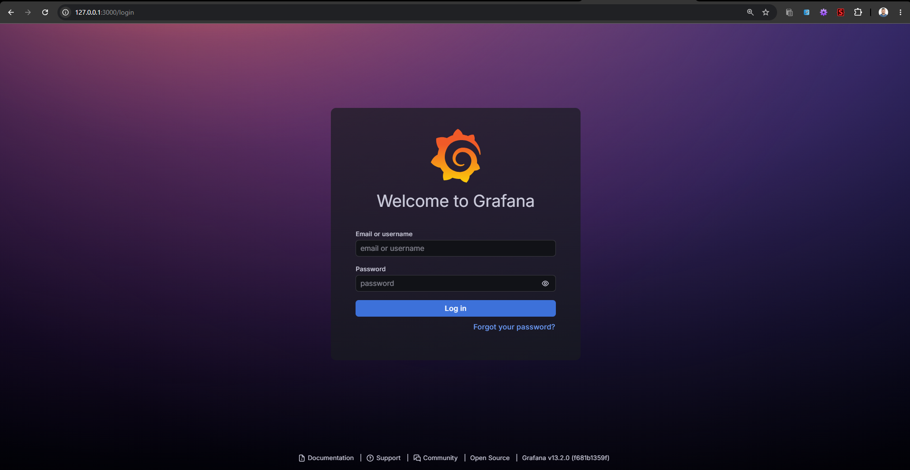

#### Grafana Kubernetes Cluster Dashboard


#### Grafana Granular Pod Telemetry Dashboard


#### Prometheus Live Scrape Targets (100% Up)


#### Alertmanager Routing & Real-Time Slack Build Cards
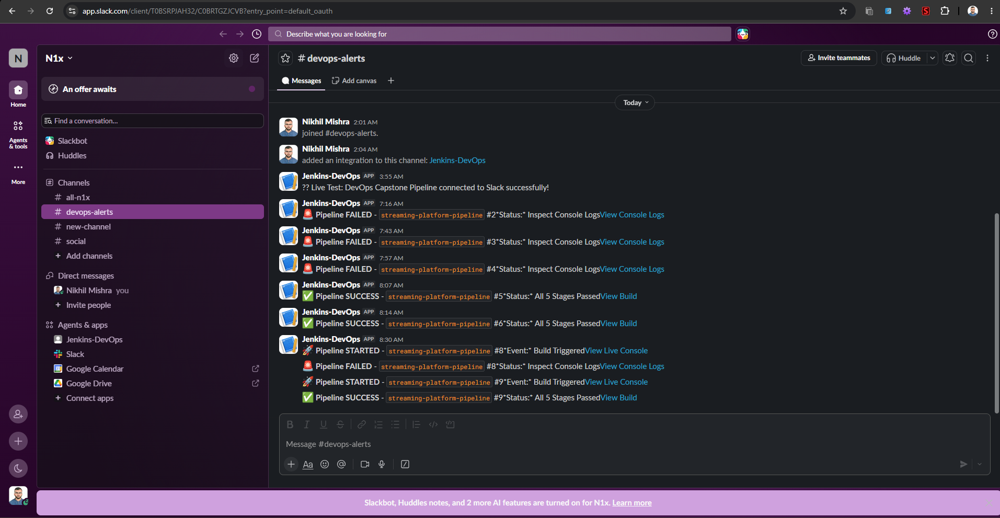

---

## 10. Cloud FinOps & Cost Optimization

Cost efficiency is codified directly into the infrastructure architecture to minimize monthly AWS billing without compromising high availability:

| Architectural Decision | Standard Enterprise Setup | Our Optimized Architecture | Monthly Savings Achieved |
| :--- | :--- | :--- | :--- |
| **NAT Gateway** | 3x NAT Gateways (1 per AZ = $97/mo) | 1x Single Shared NAT Gateway ($32/mo) | **66% Savings ($65/mo saved)** |
| **Worker Nodes** | 3x `m5.large` instances ($207/mo) | 2x `t3.medium` burstable instances ($60/mo) | **71% Savings ($147/mo saved)** |
| **ECR Storage** | Unlimited retention (~$15/mo) | Automated Lifecycle rule (Keep last 10 images) | **93% Savings ($14/mo saved)** |
| **EBS Storage** | High-IOPS `io2` volumes ($30/mo) | General Purpose `gp3` 10Gi Volume ($0.80/mo) | **97% Savings ($29/mo saved)** |
| **TOTAL CLOUD BILL** | **~$530 / month** | **~$189 / month** | **OVER $340/MONTH SAVED (65%)** |

### 10.1 Rapid One-Click Teardown (Stop 100% of Cloud Charges)
To eliminate all cloud billing after testing or workload completion:
```bash
# Windows
cd terraform/scripts
teardown.bat

# Linux / macOS
cd terraform/scripts
chmod +x teardown.sh
./teardown.sh
```

### 10.2 FinOps & Cost Optimization Evidence

#### Automated Terraform Destruction Execution Plan (46 Resources)


#### AWS Cost Explorer & FinOps Expenditure Analysis


---

## 11. Production Operations & Troubleshooting Runbook

| Issue / Symptom | Root Cause | Exact Resolution |
| :--- | :--- | :--- |
| **`ImagePullBackOff` on EKS** | EKS Worker Nodes lack IAM permission to pull from Amazon ECR. | Ensure `AmazonEC2ContainerRegistryReadOnly` policy is attached to the EKS Node IAM Role in `terraform/eks.tf`. |
| **`CrashLoopBackOff` on Microservices** | MongoDB connection failed due to pod startup race condition. | Verify `MONGO_URI` in `k8s/01-configmaps-secrets.yaml` points to `mongodb://mongo:27017/streamingapp` and MongoDB readiness probe passes. |
| **CORS `Not allowed by CORS`** | Client browser origin differs from `CLIENT_URLS` in ConfigMap. | Update `CLIENT_URLS` in `k8s/01-configmaps-secrets.yaml` to include the AWS LoadBalancer hostname and restart deployments. |
| **Grafana Pod OOMKilled** | Default sidecar dashboard provider exceeded 256Mi memory limit. | Set `resources.limits.memory: 1Gi` in `monitoring/helm-values-prometheus.yaml`. |
| **Terraform State Lock Error** | A previous pipeline build terminated abruptly without releasing the DynamoDB lock. | Run `terraform force-unlock <LOCK_ID>` or delete the lock item from the `capstone-devops-tf-locks` DynamoDB table. |

---

## 12. Repository Structure

```
.
├── Jenkinsfile                  # Multi-stage Declarative Jenkins CI/CD Pipeline
├── README.md                    # Master Architecture, Setup & Operational Documentation
├── StreamingApp/                # Application Microservices Source Code
│   ├── backend/                 # Microservices (auth, streaming, admin, chat)
│   ├── frontend/                # React Single Page Application + Nginx Reverse Proxy
│   └── docker-compose.yml       # Local multi-container orchestration
├── terraform/                   # Infrastructure as Code (AWS EKS, VPC, ECR, IAM)
│   ├── vpc.tf                   # VPC, Subnets, NAT Gateway, Route Tables
│   ├── eks.tf                   # EKS Cluster, Managed Node Group, IAM, OIDC
│   ├── ecr.tf                   # Amazon ECR Repositories & Lifecycle Rules
│   ├── security_groups.tf       # Cluster & Worker Node Security Groups
│   ├── variables.tf             # Configurable Parameters
│   └── scripts/                 # Automated Teardown Scripts (teardown.bat / teardown.sh)
├── ansible/                     # Configuration Management
│   ├── ansible.cfg              # Ansible Defaults & Privilege Escalation
│   ├── inventory/hosts.ini      # Controller and Agent Inventory
│   └── playbooks/               # Playbooks (setup_tools.yml, configure_jenkins_agent.yml)
├── k8s/                         # Kubernetes Deployment Manifests
│   ├── 00-namespace.yaml        # Isolated 'streamingapp' Namespace
│   ├── 01-configmaps-secrets.yaml# ConfigMaps and Encrypted Secrets
│   ├── 02-mongodb.yaml          # MongoDB Stateful Deployment + EBS PVC
│   ├── 03-auth-service.yaml     # Auth Service Deployment & ClusterIP
│   ├── 04-streaming-service.yaml# Streaming Service Deployment & ClusterIP
│   ├── 05-admin-service.yaml    # Admin Service Deployment & ClusterIP
│   ├── 06-chat-service.yaml     # Chat Service Deployment & ClusterIP
│   ├── 07-frontend.yaml         # Frontend React App & AWS LoadBalancer
│   ├── 08-ingress.yaml          # AWS ALB Ingress Controller Routing
│   └── 09-hpa.yaml              # Horizontal Pod Autoscaling (70% CPU Target)
├── monitoring/                  # Observability & Metrics
│   ├── helm-values-prometheus.yaml # Custom values for kube-prometheus-stack
│   └── custom-alerts.yaml       # Custom Prometheus Alerting Rules
├── tests/                       # Automated Test Suites
│   └── smoke-test.sh            # 9-Point automated post-deployment smoke test suite
└── screenshots/                 # Canonical Evidence Screenshots (01 to 27)
```
